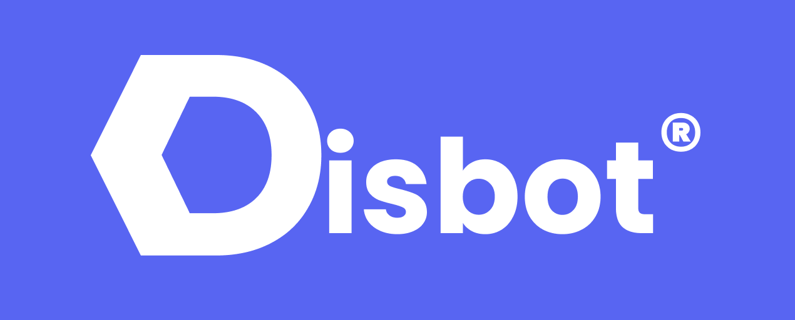

 

  

  <h3 align="center">Disbot</h3>

  

     
    <a href="https://dis-bot.xyz"><strong>Découvrir »</strong></a>
     
     
    <a href="https://dis-bot.xyz">Website</a>
    ·
    <a href="https://discord.gg/YPW3ZNuKW5">Support</a>
    ·
    <a href="https://github.com/disbot-development/disbot">Disbot</a>
    ·
    <a href="https://github.com/disbot-development/disbot-support">Disbot Support</a>
    ·
    <a href="https://github.com/disbot-development/disbot-website">Disbot Website</a>
  

  
Sommaire

  <ol>
    <li>
      <a href="#qui-sommes-nous">Qui sommes nous ?</a>
    </li>
    <li>
      <a href="#équipe">Démarrer</a>
    </li>
    <li>
      <a href="#nous-contacter">Nous contacter</a>
    </li>
    <li>
      <a href="#informations-supplémentaires">Informations supplémentaires</a>
    </li>
  </ol>

## Qui sommes nous ?

**Disbot Development** est une équipe de développement française et polyvalente. Nous sommes centrés sur l'utilisation de JavaScript et TypeScript.
Retrouvez nos projets en cliquant [ici](https://github.com/orgs/Disbot-Development/repositories).

<a href="#readme-top">retour en haut</a>

## Équipe

Voici la liste des personnes intégrées dans l'équipe.
- [@sey†](https://github.com/seyiooo)

*Remarque: Les développeurs, des places sont disponibles pour rejoindre l'équipe de développement, niveau avancé en JavaScript, TypeScript et React requis.*

## Nous contacter

Vous pouvez nous contacter depuis l'adresse e-mail suivante:
- [contact@dis-bot.xyz](mailto:contact@dis-bot.xyz)

## Informations supplémentaires

Tous nos projets sont soumises à des droits d'auteur et sous license GPL 3.0.
L'utilisation du code source de l'un de nos projets est protégée par des droits d'auteur. Toute utilisation, modification ou distribution du code source doit se conformer aux licences et aux droits d'auteur applicables.

<a href="#readme-top">retour en haut</a>

